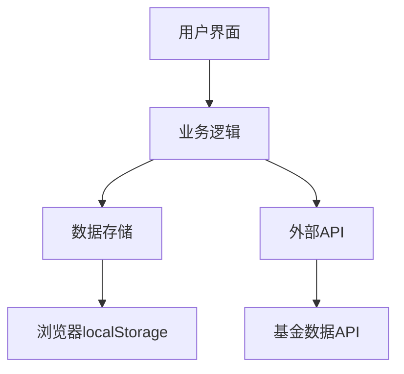
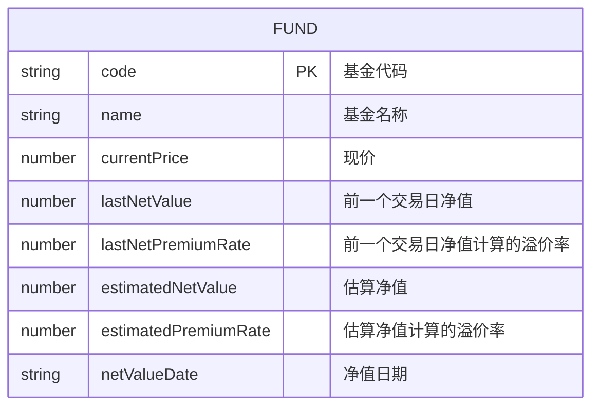

## 1. Architecture Design
本项目采用纯前端架构，使用HTML、CSS和JavaScript实现所有功能，无需后端服务器。基金数据通过公开API获取，数据存储在浏览器本地（localStorage）中。


## 2. Technology Description
- 前端：纯HTML5 + CSS3 + JavaScript (ES6+)
- 初始化工具：无额外框架，使用原生JavaScript
- 后端：无后端
- 数据库：浏览器localStorage
- 数据获取：使用fetch API调用第三方基金数据服务

## 3. Route Definitions
| Route | Purpose |
|-------|---------|
| / | 主页面，所有功能都在这一页 |

## 4. API Definitions (if backend exists)
本项目无后端，所有API调用都是前端直接请求第三方服务

## 5. Server Architecture Diagram (if backend exists)
本项目无后端

## 6. Data Model (if applicable)
### 6.1 Data Model Definition


### 6.2 Data Definition Language
本项目使用localStorage存储数据，格式为JSON数组：
```json
[
  {
    "code": "161725",
    "name": "招商中证白酒指数(LOF)A",
    "currentPrice": 1.234,
    "lastNetValue": 1.220,
    "lastNetPremiumRate": 1.15,
    "estimatedNetValue": 1.240,
    "estimatedPremiumRate": -0.48,
    "netValueDate": "2024-05-27"
  }
]
```
