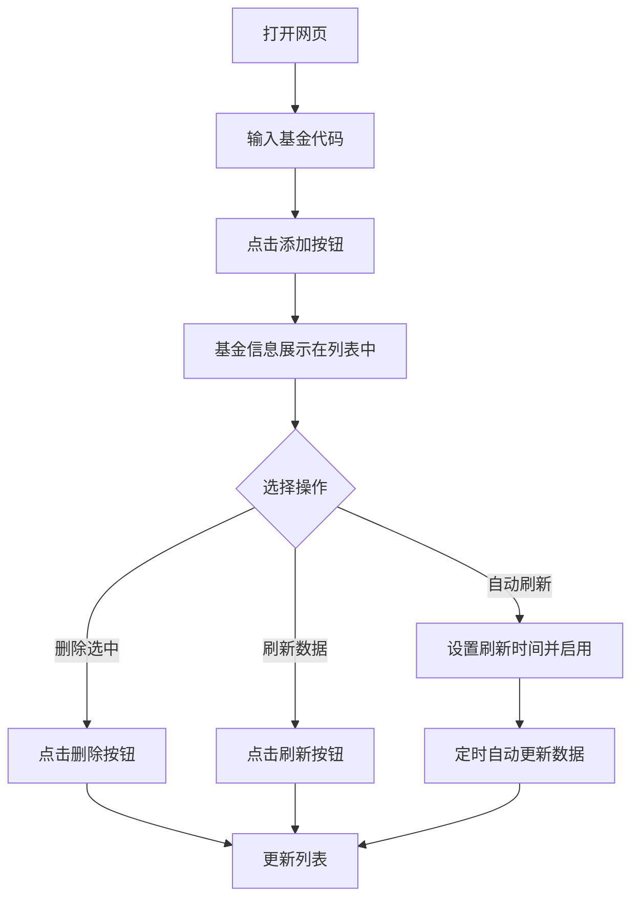

## 1. Product Overview
基金溢价率计算工具是一个简单易用的网页应用，帮助用户实时跟踪和计算基金的溢价率，支持批量管理和自动刷新功能。
- 主要用途：帮助用户快速了解基金的溢价率信息，支持手动和自动刷新数据
- 目标用户：需要监控基金溢价率的投资者和理财爱好者

## 2. Core Features

### 2.1 User Roles (if applicable)
本工具无需用户注册，所有访问者均可使用所有功能

### 2.2 Feature Module
1. **主页面**：基金代码输入、基金列表展示、数据操作按钮
2. **数据管理**：添加、删除、刷新基金数据
3. **自动刷新**：可设置自动刷新间隔时间

### 2.3 Page Details
| Page Name | Module Name | Feature description |
|-----------|-------------|---------------------|
| 主页面 | 标题栏 | 显示工具名称：基金溢价率计算工具 |
| 主页面 | 基金代码输入 | 提供搜索框输入基金代码，支持添加按钮添加到列表 |
| 主页面 | 操作按钮栏 | 包含刷新按钮、删除按钮、自动刷新按钮 |
| 主页面 | 自动刷新设置 | 提供下拉菜单选择自动刷新间隔时间 |
| 主页面 | 基金列表 | 展示基金代码、基金名称、现价、前一个交易日净值、前一个交易日净值计算的溢价率、估算净值、估算净值计算的溢价、净值日期等信息 |
| 主页面 | 选择功能 | 支持单个选择、全选/取消全选功能，用于批量删除 |

## 3. Core Process
用户打开网页，输入基金代码并点击添加按钮，基金信息会显示在列表中。用户可以选择单个或多个基金进行删除，点击刷新按钮更新所有基金数据，或启用自动刷新功能定期更新数据。

## 4. User Interface Design
### 4.1 Design Style
- 主色调：蓝色系（#3B82F6）代表专业和信任
- 次要色：深灰色（#374151）和浅灰色（#F3F4F6）
- 按钮风格：圆角矩形，带有悬停效果
- 字体：Inter 或系统默认字体，标题使用稍大字号
- 布局风格：卡片式布局，清晰分明
- 图标：使用简洁的线性图标

### 4.2 Page Design Overview
| Page Name | Module Name | UI Elements |
|-----------|-------------|-------------|
| 主页面 | 标题栏 | 居中显示，蓝色标题文字，下方有分隔线 |
| 主页面 | 输入区域 | 水平排列的输入框和添加按钮，输入框有边框和焦点效果 |
| 主页面 | 操作按钮栏 | 水平排列的刷新、删除、自动刷新按钮，颜色区分功能 |
| 主页面 | 自动刷新设置 | 下拉选择框，选项包括10秒、30秒、1分钟、5分钟 |
| 主页面 | 基金列表 | 表格布局，表头固定，带有复选框列，奇偶行颜色区分，悬停高亮效果 |

### 4.3 Responsiveness
- 桌面端优先设计，自适应屏幕宽度
- 在小屏幕上，表格支持水平滚动
- 按钮和输入框在移动设备上保持可点击的尺寸
- 触控优化，便于在移动设备上操作

### 4.4 3D Scene Guidance (if applicable)
本项目不涉及3D场景
